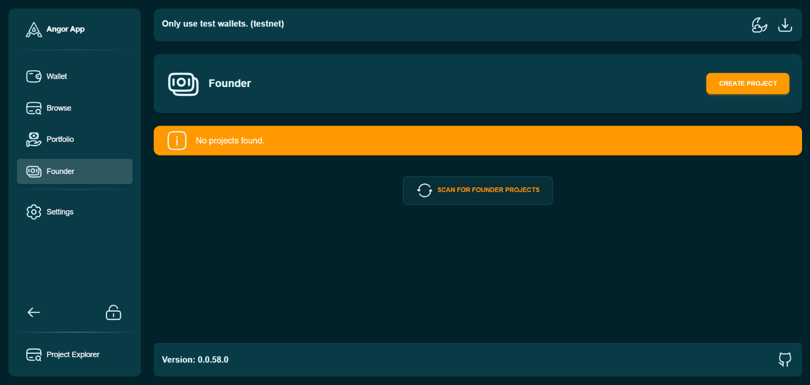
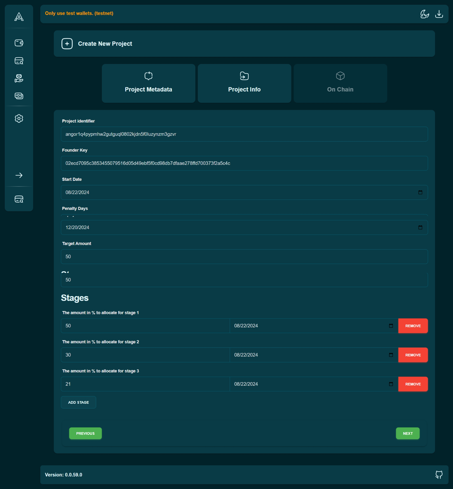

## Creating a Project

1. Sign In: Create a new wallet or recover an existing one on Angor.

2. Create a New Project:

* Enter your project details, including title, description, goals, and funding needs.

* Add a Banner: Upload a banner for your project to make it stand out.

3. Set Milestones: Define your project milestones using time-lock contracts.

4. Submit for Review: Once your project is ready, submit it for review.

### Project Approval
Your project will be reviewed by the Angor team. Once approved, it will be listed for investors.