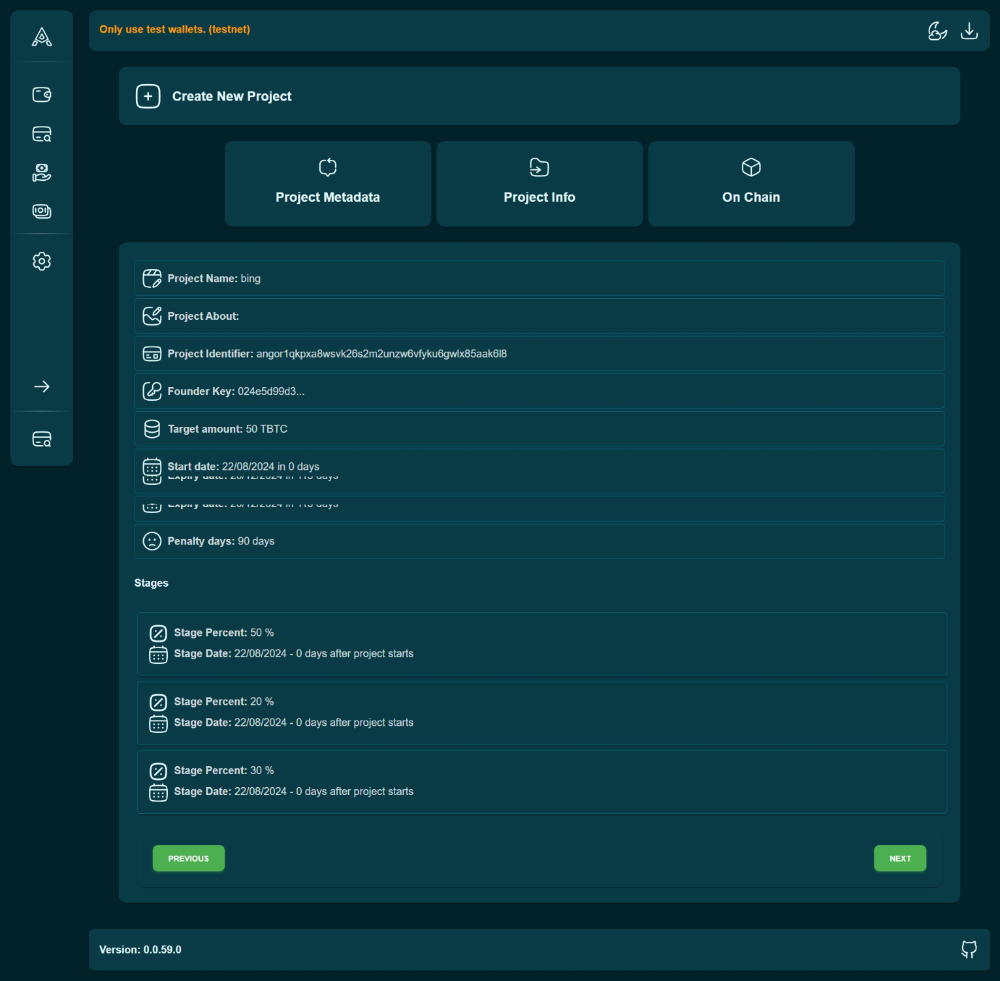

### Step 1: Create a Wallet
To begin, create a new Bitcoin wallet on Angor. This wallet will be your primary tool for managing all your project-related activities and funds.

### Step 2: Create a New Project

* **Enter Project Details:** Provide a comprehensive overview of your project by filling in the required details, including the title, description, goals, and the amount of funding you need. Ensure your description clearly communicates the purpose and vision of your project to potential investors.
* **Add a Banner:** Upload a visually appealing banner that represents your project. This banner will be displayed on your project page and will help attract attention from potential investors.

### Step 3: Set Milestones
Milestones are crucial checkpoints for your project. Use time-lock contracts to define these milestones, ensuring that funds are released gradually as each milestone is achieved. This approach builds trust with investors and helps you manage your project more effectively.

### Step 4: Submit Your Project
After you’ve completed all the necessary steps and are confident in your project’s readiness, submit it for listing on Angor. There’s no need for a formal review process; once submitted, your project will be immediately visible to all potential investors.

### Engage with Investors
Once your project is listed on Angor, it’s crucial to actively engage with potential investors. Use Browse, a Nostr client specifically designed for Angor projects, to interact directly with investors. Address their questions and concerns promptly and clearly. Providing thoughtful responses will help build trust and increase the likelihood of securing the necessary funding to bring your project to life.
