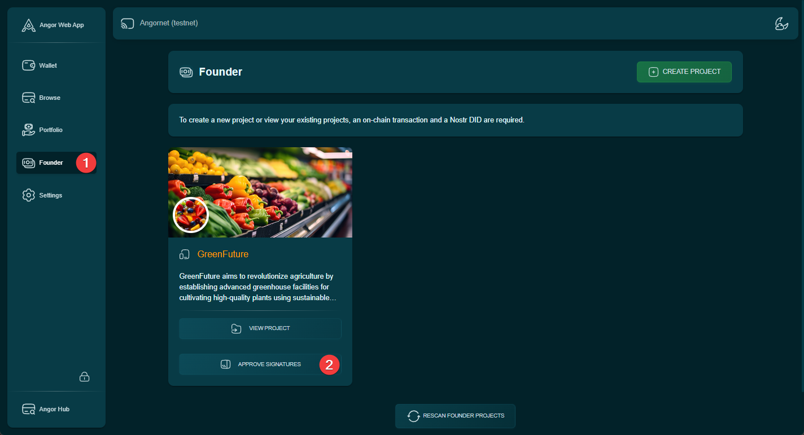
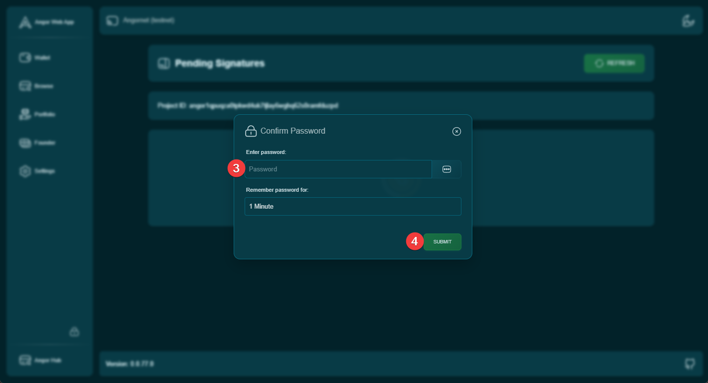
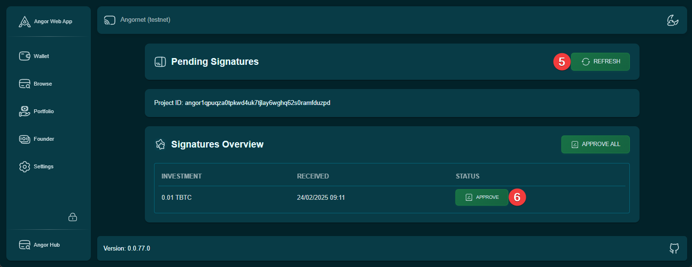
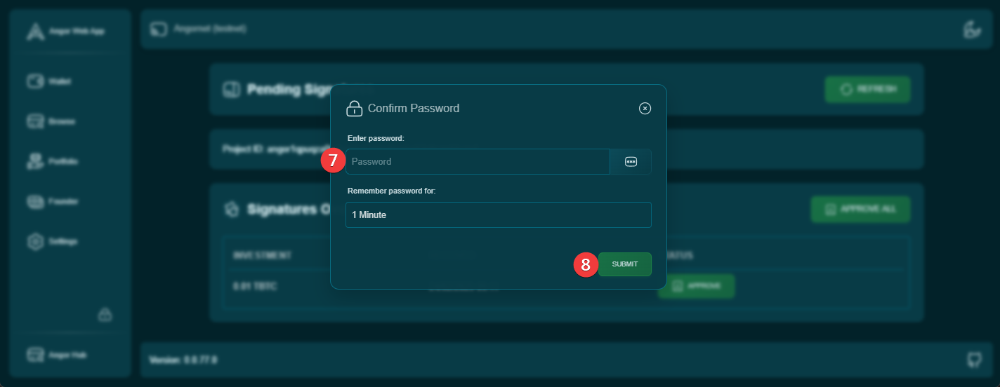
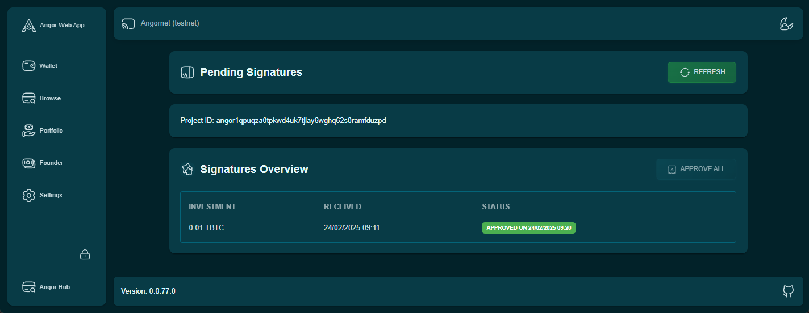

This guide explains how project founders can approve investor signatures to allow them to invest in the project.

## Steps to Approve Signatures

### 1. Access the Approval Section
Navigate to the "Founder" section and click the "Approve Signatures" button.

### 2. Wallet Authentication
Enter your wallet password when prompted to proceed with the approval process.

### 3. Review Pending Signatures
On the "Pending Signatures" page:
1. Click the "Refresh" button to load all pending signature requests
2. Review the list of pending signatures from investors
3. Select the signatures you wish to approve

### 4. Confirm Approval
Enter your wallet password again to confirm and process the signature approvals.

### 5. Verification
After approval, you can view and verify all approved signatures in the completed signatures list.

## Important Notes
- Always review the signature details carefully before approval
- Approved signatures cannot be revoked
- Investors can only invest after their signatures are approved
- Regular checking of pending signatures is recommended
