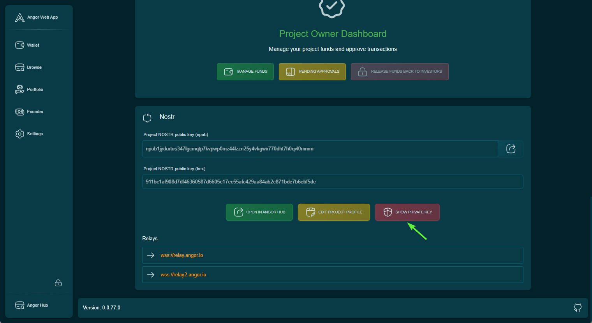

This guide explains how to manage your project's Nostr profile, access private keys, and utilize Angor Hub features.

## Managing Your Project's Nostr Profile

### Accessing Private Key
To obtain your project's Nostr profile private key:
1. Navigate to the project "View" section
2. Scroll to the bottom of the page
3. Click the "Show Private Key" button
4. Your private key will be displayed

### Editing Project Profile
To update your project's profile information, including FAQ, team members, and slideshow:
1. Click the "Edit Project Profile" button
2. You will be redirected to the Angor Profile application
3. Here you can:
   - Update profile information
   - Create and manage FAQ sections
   - Add team members
   - Create slideshows for your Angor Hub profile

### Viewing on Angor Hub
To view your project's complete profile and latest information on Angor Hub:
1. Click the "Open in Angor Hub" button
2. This will take you to your project's public profile page
3. Here you can view:
   - Comprehensive project information
   - Latest updates
   - Team members
   - FAQ sections
   - Project slideshows

## Features Available in Angor Profile

- **Profile Management**: Update basic project information
- **FAQ Creation**: Add and manage frequently asked questions
- **Team Section**: Introduce team members and their roles
- **Slideshow Creation**: Create engaging presentations about your project
- **Real-time Updates**: All changes are reflected immediately on Angor Hub

## Important Notes
- Keep your private key secure and never share it
- Regular profile updates help maintain investor interest
- Use high-quality images for team members and slideshows
- Ensure all information is accurate and up-to-date
