Creating a new project on Angor Platform is a systematic process that involves multiple steps to ensure all necessary information is properly recorded and secured on the blockchain. This guide will walk you through each step of the project creation process, from initial metadata entry to final blockchain confirmation.

## Project Creation Process

### 1. Accessing Project Creation
Navigate to the Founder section and locate the "Create Project" button to begin the process.

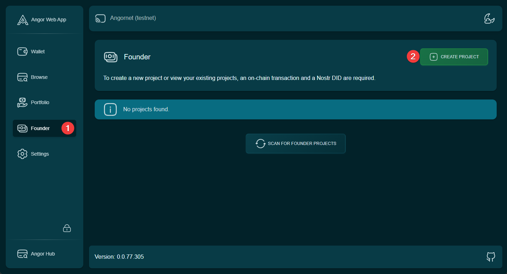

### 2. Project Metadata
In the "Project Metadata" tab, provide the following essential information:
- Project name
- Project description
- Website URL
- Banner image
- Profile picture

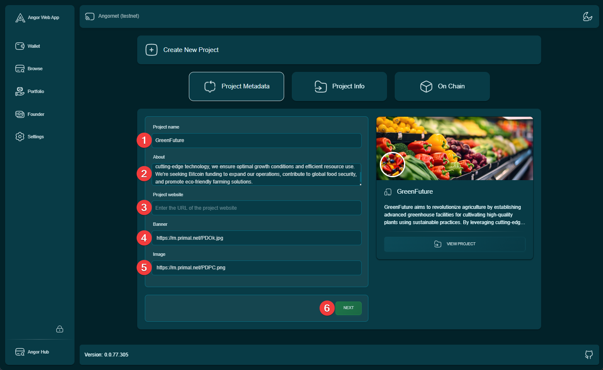

### 3. Project Information
The "Project Info" tab requires detailed project parameters:
- Project start date
- Penalty days
- Project expiration date
- Target Bitcoin amount
- Project stages and their timelines

### 4. Stage Configuration
Review and configure your project stages with their respective deadlines.

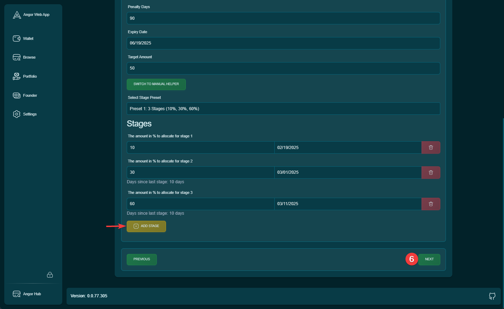

### 5. On-Chain Review
In the "On Chain" tab, carefully review all previously entered information before proceeding with blockchain registration.

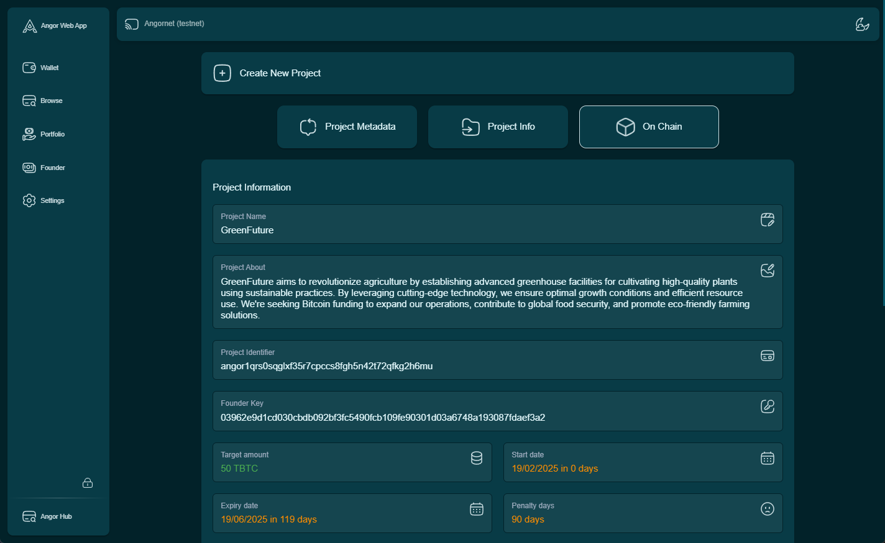

### 6. Nostr Profile Creation
Click the designated button to initiate Nostr profile creation for your project.

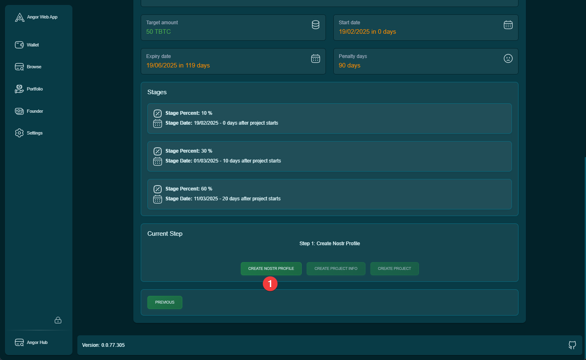

### 7. Profile Creation Confirmation
Confirm the creation of your project's Nostr profile.

### 8. Wallet Authentication
Enter your wallet password to proceed with profile creation.

### 9. Smart Contract Storage
Initialize the smart contract storage by clicking the "Create Project Info" button.

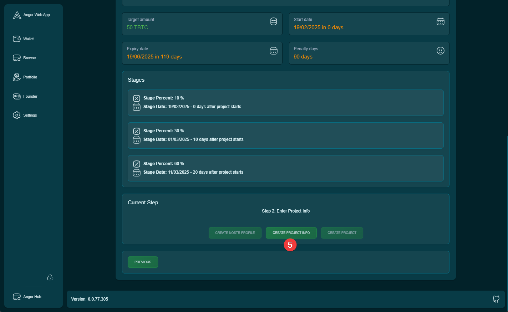

### 10. Storage Confirmation
Confirm the storage of project information.

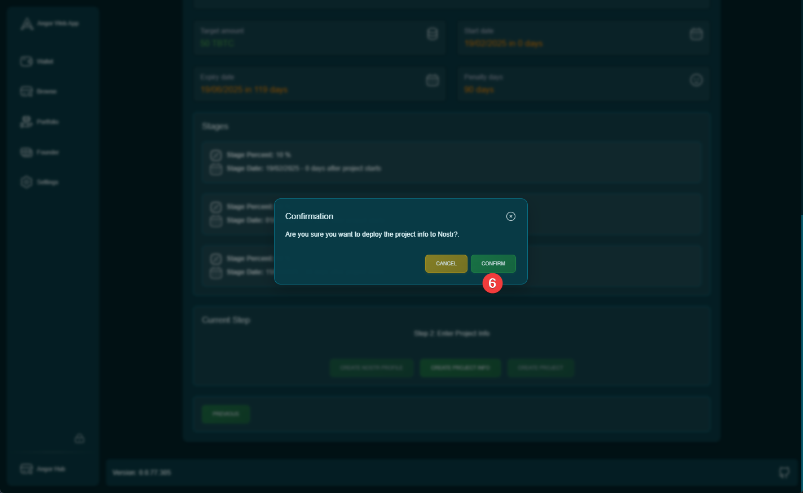

### 11. Wallet Verification
Enter your wallet password again to authorize the storage of project information.

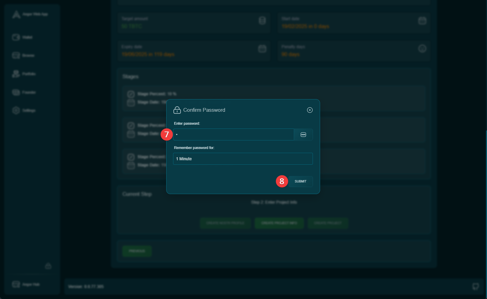

### 12. Project Creation Initialization
Click the "Create Project" button to begin the final creation process.

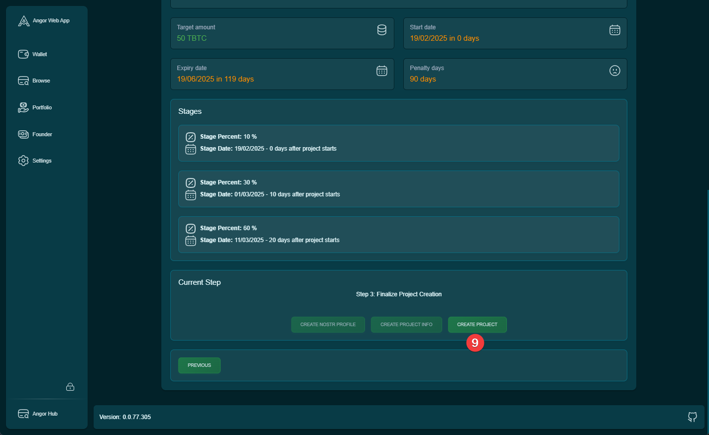

### 13. Blockchain Registration
In the confirmation window, review all information one final time and click "Confirm" to register your project on the blockchain.

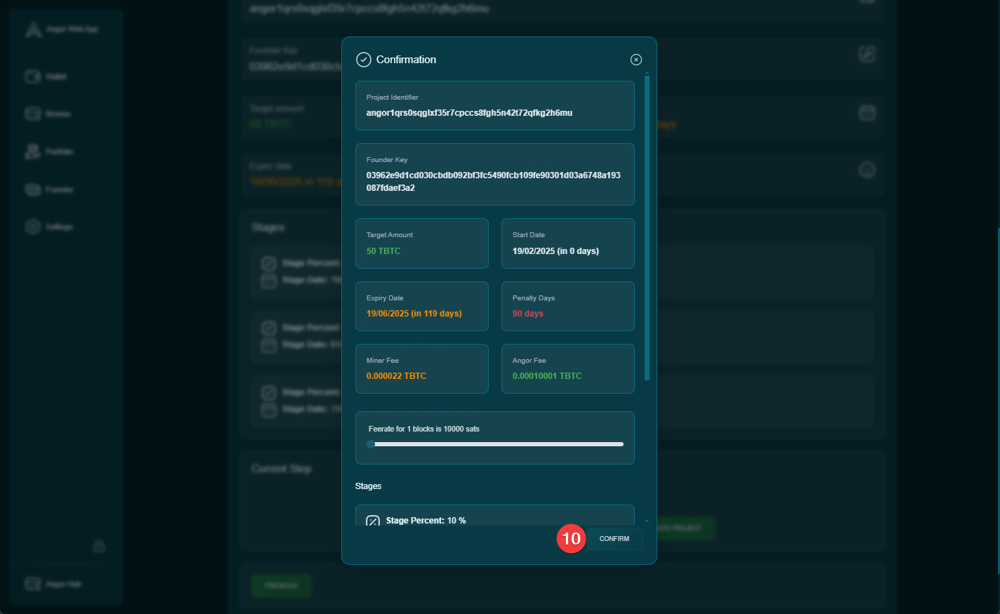

### 14. Project View
After successful creation, you'll be able to view your newly created project.

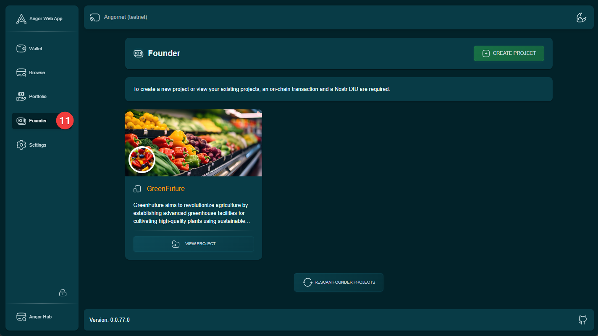

## Important Notes
- Double-check all information before proceeding to each next step
- Ensure your wallet has sufficient funds for transaction fees
- Keep your wallet password readily available as you'll need it multiple times
- Make sure all images meet the required specifications
- Save your project details in a secure location for future reference
