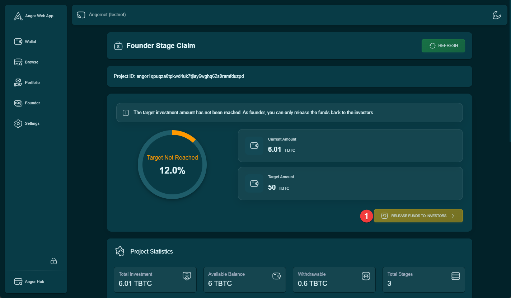

This guide explains how project founders can return invested Bitcoin to investors when a project doesn't reach its funding target, with no penalties applied.

## Fund Release Process

### 1. Access Project Dashboard
Navigate to the Founder section and open your project dashboard.

### 2. Fund Management
1. Locate the "Manage Funds" button in your project dashboard
2. Click to access the fund management interface

### 3. Initiate Fund Release
Find and click the "Release Funds to Investors" button to start the return process.

### 4. Wallet Authentication
Enter your wallet password when prompted to proceed with the fund release process.

### 5. Confirm Fund Release
On the "Release Funds" page:
1. Review the total amount to be released
2. Verify the number of investors
3. Click the release button to proceed

### 6. Final Authorization
Enter your wallet password again to confirm and execute the fund release.

### 7. Release Verification
After completion, you can view:
- Total amount released
- List of successful transfers
- Transaction details

## Important Notes
- This process is irreversible
- All investors receive their full investment back
- No penalties are applied to investors
- Funds are returned to the original investing addresses
- The process may take some time depending on the number of investors

## Best Practices
- Communicate with investors before initiating the release
- Ensure you have enough time to complete the process
- Keep transaction records for future reference
- Verify all amounts before confirming the release
