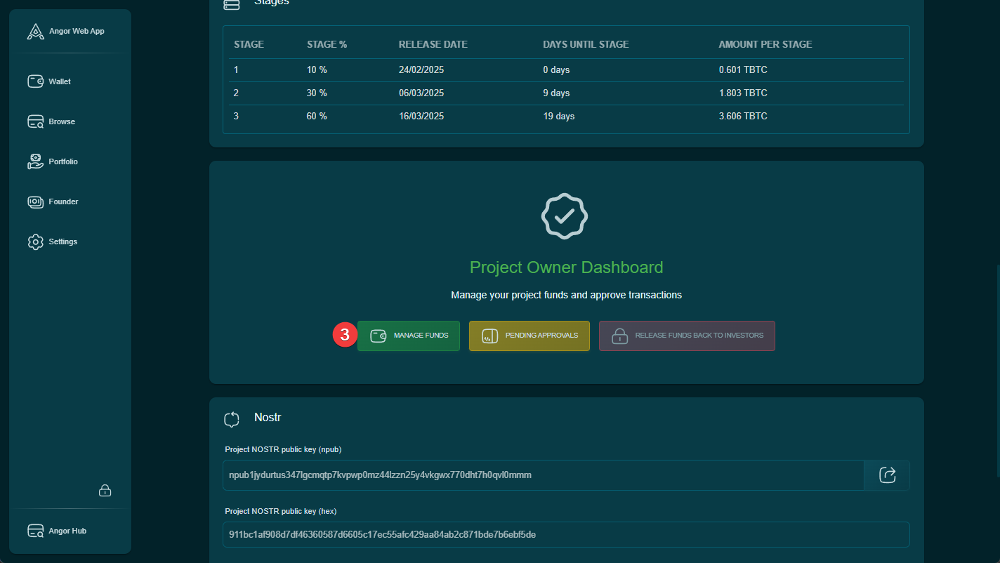
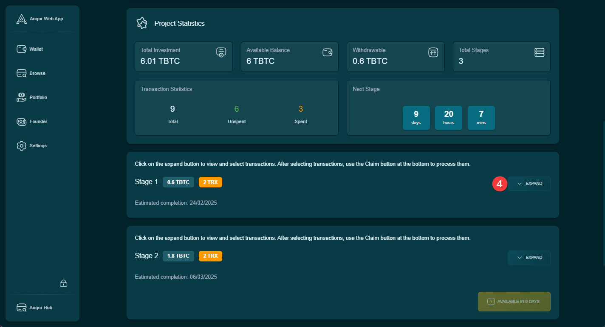
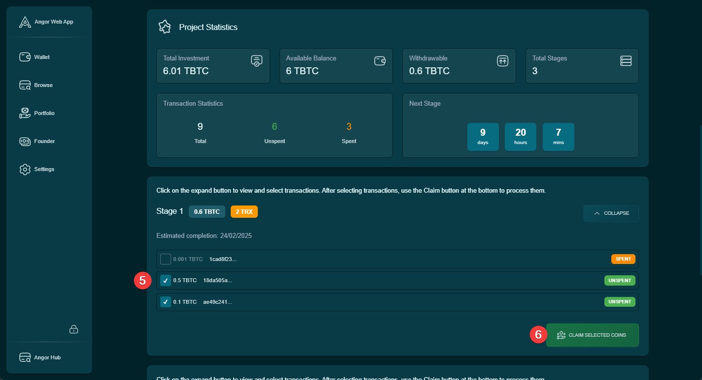

This guide explains how project founders can claim and spend the Bitcoin funds raised during their fundraising campaign, according to the predefined project stages.

## Accessing Fund Management

### 1. Navigate to Project Dashboard
Access your project through the Founder section to view your project dashboard.

### 2. Fund Management Section
1. Locate and click the "Manage Funds" button in your project dashboard
2. This will take you to the fund management interface where you can view all project stages

### 3. View Stage Details
For each project stage:
1. Find the stage you want to manage
2. Click the "Expand" button to view detailed information about:
   - Available funds
   - Claiming deadlines
   - Previous claims
   - Remaining balance

### 4. Claim Available Funds
To claim funds for a specific stage:
1. Review the unclaimed items in the expanded stage view
2. Select the checkboxes next to the unclaimed amounts you wish to withdraw
3. Click the "Claim Selected Coins" button to initiate the transfer
4. Confirm the transaction with your wallet

## Important Considerations

### Timing Requirements
- Funds can only be claimed during their designated stage periods
- Each stage has specific start and end dates
- Claims must be made within the specified timeframe

### Financial Management
- Keep track of claimed and unclaimed amounts
- Plan your withdrawals according to project needs
- Maintain transparency with investors regarding fund usage

### Security Notes
- Double-check all claim amounts before confirming
- Ensure your wallet is properly secured
- Keep records of all transactions

## Best Practices
- Only claim funds when needed for project development
- Regularly review available funds across all stages
- Document the purpose of each claim for transparency
- Communicate major withdrawals to your investor community
