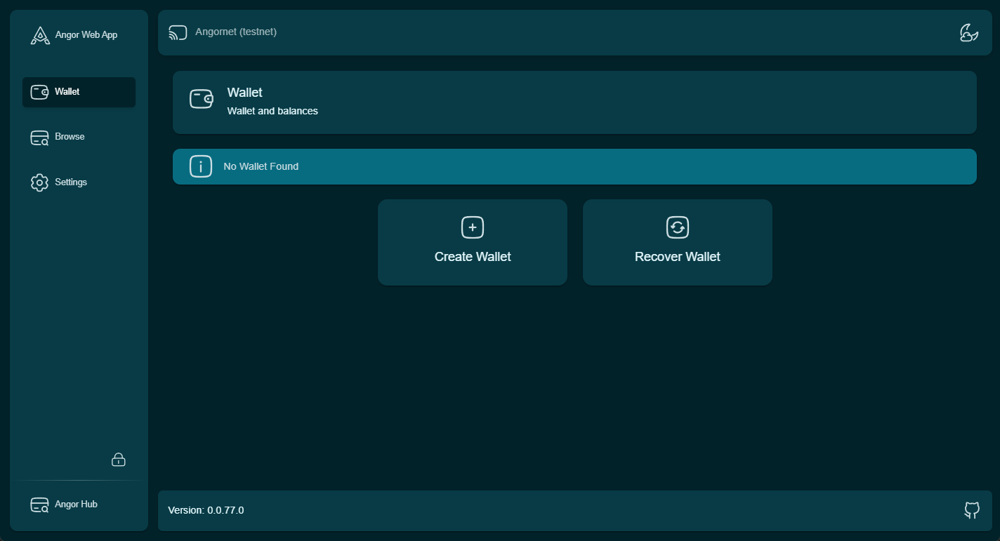
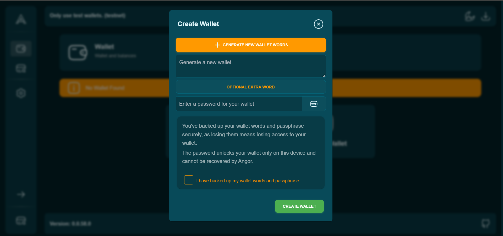

### Step 1: Create a Wallet

To begin using Angor, the first step is to create a Bitcoin wallet. This wallet will serve as your gateway to all the features offered by the Angor platform. Follow these steps to set up your wallet:

* **Click on "Create Wallet":** Simply select the “Create Wallet” option on your dashboard to initiate the process.

* **Automatic Wallet Setup:** Angor will automatically generate and configure your Bitcoin wallet, ensuring a smooth and hassle-free setup experience.

### Step 2: Secure Your Wallet with Recovery Phrases

Once your wallet is created, it’s crucial to secure it properly. Here’s how:

* **Record Your Recovery Phrases:** After your wallet is set up, you will be provided with a set of recovery phrases. These phrases are essential for recovering your wallet if you lose access. Write them down accurately and store them in a secure, offline location.

* **Verify Recovery Phrases:** To ensure you’ve recorded your recovery phrases correctly, you may be asked to verify them. This step is crucial to confirm that you have a reliable backup.

* **Store Safely:** Your recovery phrases are the only way to recover your wallet if you lose access, so make sure to keep them in a safe and secure place.
