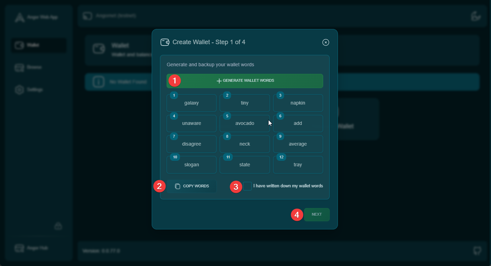

## Getting Started with Your Bitcoin Wallet

To begin using Angor, you'll need a Bitcoin wallet. You can either create a new wallet or recover an existing one.

## Creating a New Wallet

### Step 1: Generate Wallet Words

* Click the "Generate Wallet Words" button to create your unique recovery phrase

* You'll receive a set of words that serve as your wallet's backup
* Copy these words and store them securely
* Confirm that you've written down your wallet words by checking the checkbox

### Step 2: Verify Recovery Phrases

* You'll be asked to verify specific words from your recovery phrase
* Enter the requested words in the correct order
* This step ensures you've properly recorded your recovery phrase
* For testnet wallets, there's an option to skip verification

### Step 3: Optional Passphrase

* Choose whether to add an extra layer of security with a passphrase

* This is optional but recommended for additional protection
* If enabled, enter your chosen passphrase
* Remember: You must keep this passphrase safe as it's required to access your wallet

### Step 4: Set Wallet Password

* Create a password to protect your wallet
* This password will be required to access your wallet
* You can toggle password visibility while typing

## Recovering an Existing Wallet

### Step 1: Enter Recovery Phrase

* Enter your existing wallet's recovery phrase
* Make sure to enter the words in the correct order
* The system will validate your recovery phrase

### Step 2: Enter Passphrase (if applicable)

* If your wallet was created with a passphrase, enter it

* Skip this step if you didn't use a passphrase originally
* Click the shield icon to toggle passphrase input

### Step 3: Set New Password

* Create a new password for your recovered wallet
* This password will protect your wallet on this device
* You can toggle password visibility while typing

## Important Security Notes

* Never share your recovery phrase or passphrase with anyone
* Store your recovery phrase in a secure, offline location
* Your recovery phrase is the only way to restore your wallet if lost
* Consider using the optional passphrase for additional security
* Keep your wallet password safe and memorable

