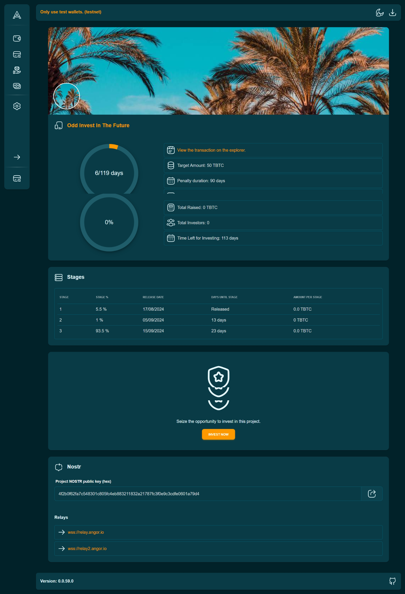
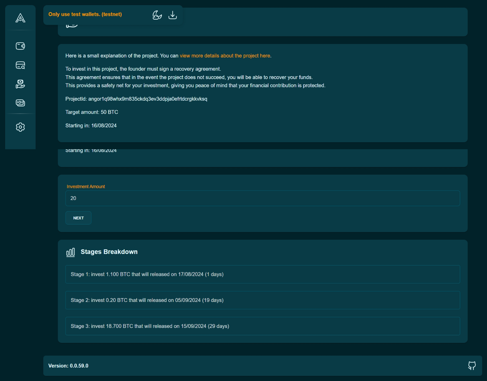
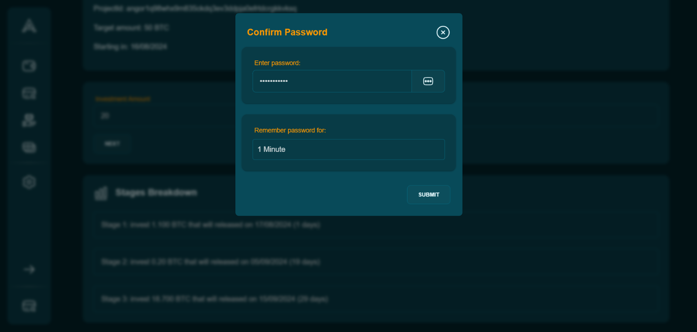

1. Browse Projects: Explore projects listed on Angor.

2. Select a Project: Choose a project that interests you.

3. Invest Funds: Decide on an amount, confirm your investment, and wait for the transaction to confirm on the blockchain.

* Click on the “Invest” button.
* Enter the amount you wish to invest in the provided field.
* Click “Submit” to confirm the transaction.

You will be asked to input your password to confirm the transaction.
### Wait for the founder to approve (this is a manual process by the founder).
Wait for the transaction to be confirmed on the blockchain. This may take a few minutes.

### Investor Control

_You have the ability to recover unspent funds if a project doesn’t meet its milestones, ensuring your investment is secure._

