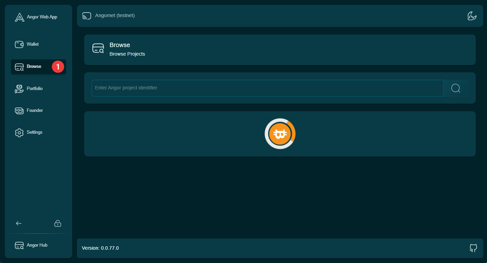

# Finding Investment Projects on Angor

There are two main ways to discover investment opportunities on Angor:

## 1. Using Angor App

The Browse section on Angor's main platform provides a quick overview of the most recent investment opportunities:

- Displays the 21 most recently listed projects
- Shows key project information at a glance:
  - Project name and description
  - Funding goal
  - Current investment status
  - Project category
  - Timeline

### How to Use Browse:

1. Navigate to the Browse section on Angor's main platform
2. Use the available filters to narrow down projects by:
   - Category
   - Investment size
   - Project stage
   - Region
3. Click on any project card to view detailed information

## 2. Exploring Angor Hub

For a more extensive selection of projects:

1. Visit [Angor Hub](https://hub.angor.io)
2. Access the complete database of all listed projects
3. Use advanced search and filter options
4. View detailed analytics and project metrics

### Angor Hub Features:

- Complete project listing
- Advanced search functionality
- Detailed project analytics
- Historical performance data
- Community feedback and ratings

For detailed information about using Angor Hub, please refer to our [Angor Hub Guide](../use-angor-hub).

## Best Practices for Project Discovery

1. **Regular Monitoring**: Check both Browse and Angor Hub regularly for new opportunities
2. **Use Filters**: Utilize available filters to find projects matching your investment criteria
3. **Due Diligence**: Always review project details thoroughly before making investment decisions
4. **Track Favorites**: Save interesting projects to your watchlist for future reference

> **Note**: While Browse shows the most recent 21 projects, Angor Hub provides access to the complete project database with additional features and analytics tools.