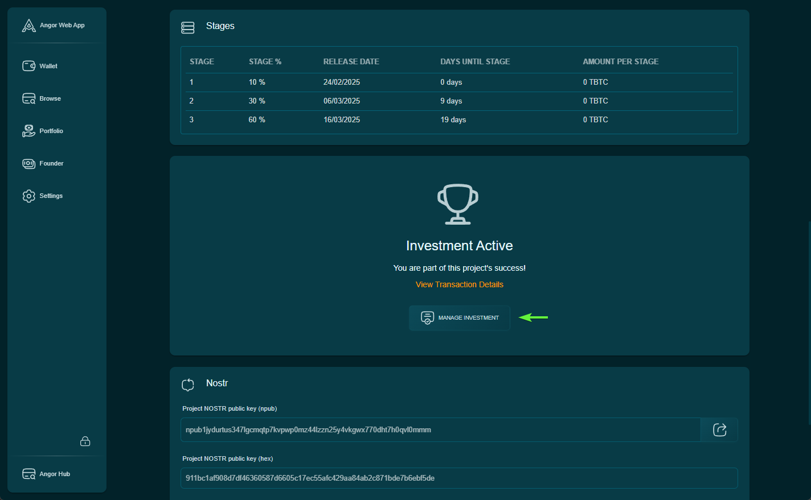
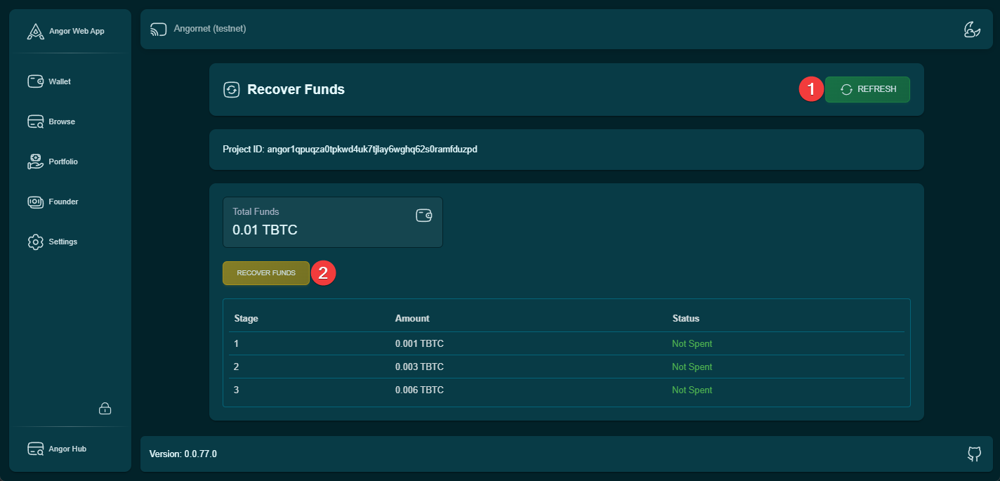
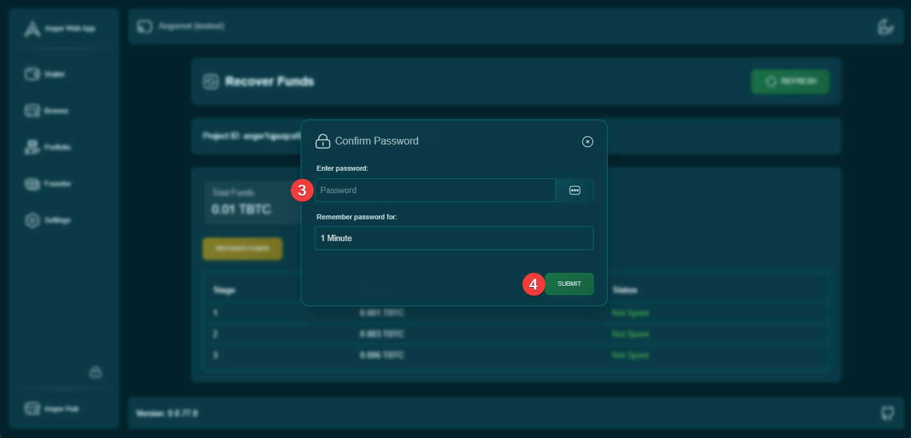
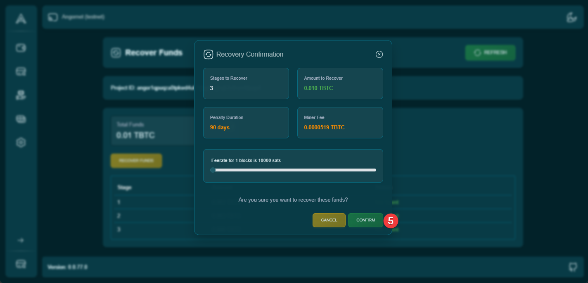
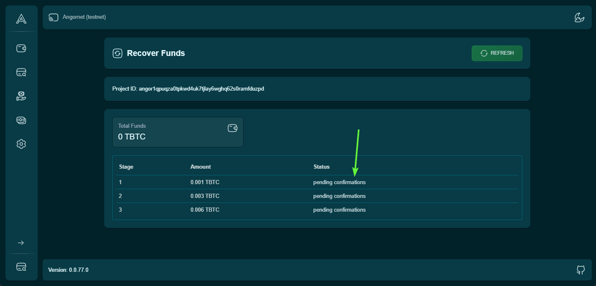
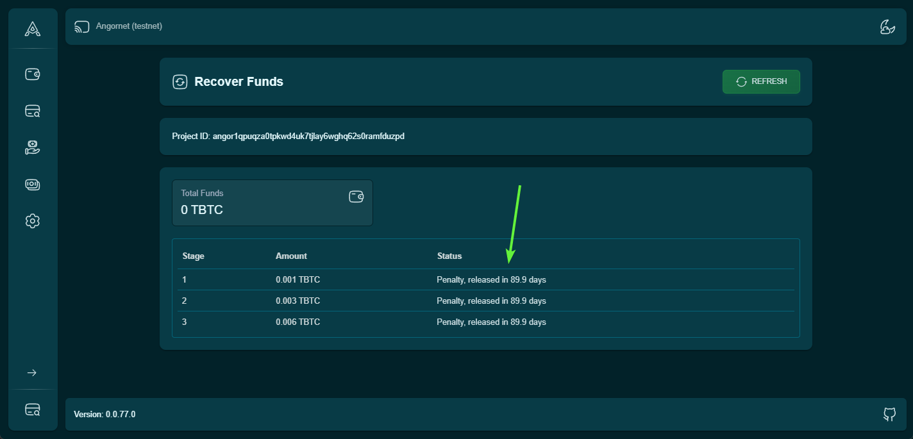
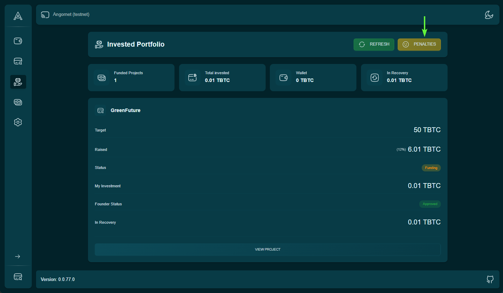
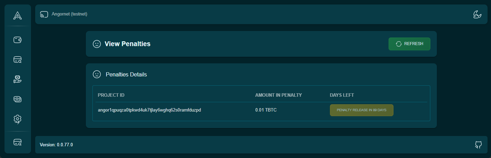

# Fund Recovery Process Guide

This guide will walk you through the complete process of recovering your invested funds in Angor, with detailed steps and visual guidance.

## Step 1: Access Project Dashboard

Navigate to your dashboard and locate the project where you want to recover funds.

In the project view section, you'll find details about your investment and recovery options.

## Step 2: Refresh and Initiate Recovery

1. Click the refresh button to sync latest data from Bitcoin network and Nostr
2. Look for the "Recover Funds" button
3. Click "Recover Funds" to start the process

## Step 3: Wallet Authentication

Enter your wallet password to authorize the recovery transaction.

*Important: Ensure you're using the correct wallet that holds the investment.*

## Step 4: Confirm Recovery

Review the recovery details and confirm the transaction.

The confirmation screen will show:
- Amount to be recovered
- Penalty period details
- Network fees

## Step 5: Transaction Confirmation

Wait for the recovery transaction to be confirmed on the Bitcoin network.

You can track the transaction status directly from this screen.

## Step 6: Penalty Period

The recovered funds will be locked for the penalty period duration.

*Note: The penalty period is a mandatory waiting time before funds become available.*

## Step 7: View Recovered Funds

Check your recovered funds in the "Invested Portfolio" section under the "Penalty" tab.

This section shows all your recovered investments that are currently in the penalty period.

## Step 8: Penalty Period Completion

Once the penalty period ends, you can withdraw your recovered funds.

The section displays:
- Total recovered amount
- Remaining penalty time
- Withdrawal options (when available)

## Important Notes

- Ensure stable internet connection during the recovery process
- Keep your wallet accessible throughout the process
- Monitor the penalty period countdown
- Double-check all transaction details before confirmation

## Next Steps

- [Understanding Penalty Periods](./penalty-periods)
- [Withdrawal Guide](./withdrawals)
- [Recovery FAQ](./recovery-faq)
