# How to Invest in Projects

Before any investment can take place, Angor implements a crucial security measure: the Recovery Agreement Protocol. This is a fundamental safety feature that protects investors' funds.

## Understanding the Recovery Agreement

### What is a Recovery Agreement?
A recovery agreement is a smart contract-based commitment between the investor and project founder that:
- Guarantees your right to recover unused funds
- Sets specific conditions for fund recovery
- Establishes timelock parameters
- Documents mutual responsibilities
- Creates a binding on-chain record

### Why is it Important?
- **Risk Mitigation**: Protects investors from total loss
- **Trust Building**: Creates accountability for project founders
- **Transparency**: Clear terms for fund recovery
- **Legal Protection**: On-chain proof of agreement
- **Smart Contract Security**: Automated enforcement of terms

### How it Works
1. Investor initiates recovery permission request
2. Founder reviews investor details
3. Both parties agree to recovery terms
4. Smart contract records the agreement
5. Recovery conditions are programmatically enforced

## Recovery Agreement Process

### Step 1: Browse and Select Project
Navigate to the Browse section to find your desired project.

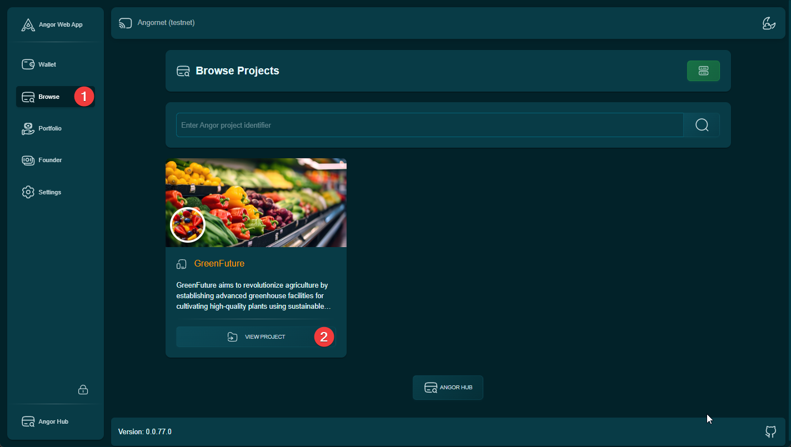

### Step 2: Project Analysis
Review detailed project information including:
- Project overview
- Team details
- Investment terms
- Technical specifications
- Risk factors

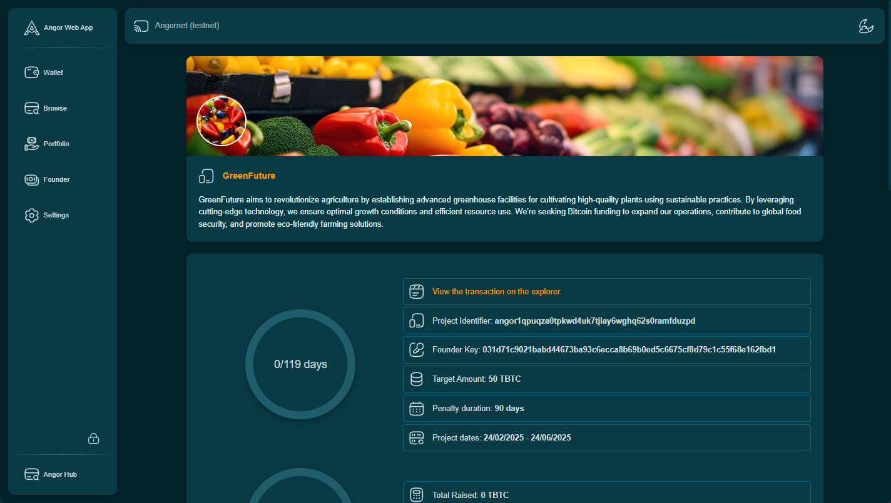

### Step 3: Initiate Investment
Click the "Invest Now" button to start the investment process.

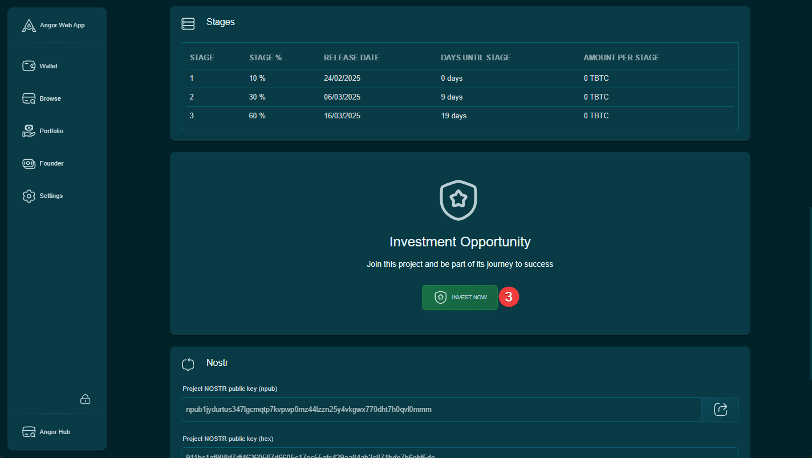

### Step 4: Set Investment Amount
Choose your investment amount and click "Continue to Confirmation" to proceed.

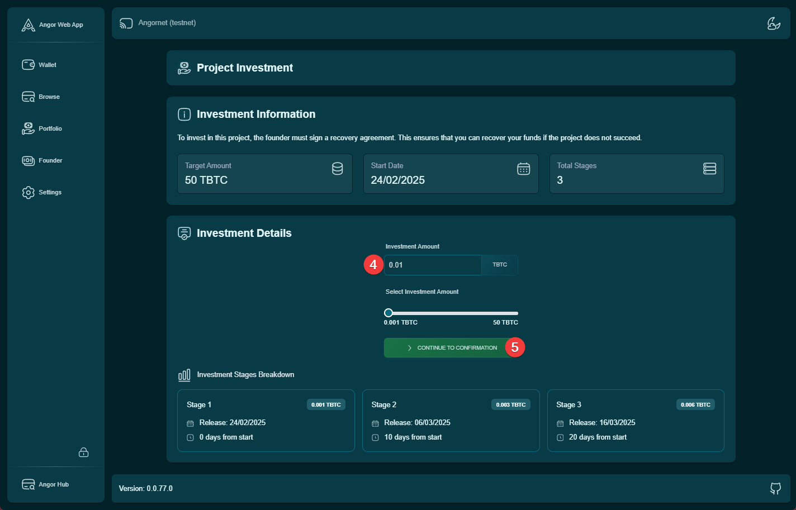

### Step 5: Wallet Authentication
Enter your wallet password to authenticate the request.

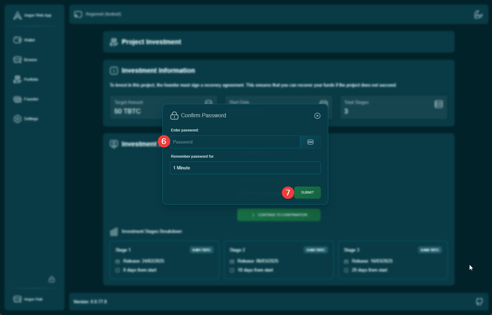

### Step 6: Confirm Request
Review and confirm your recovery permission request details.

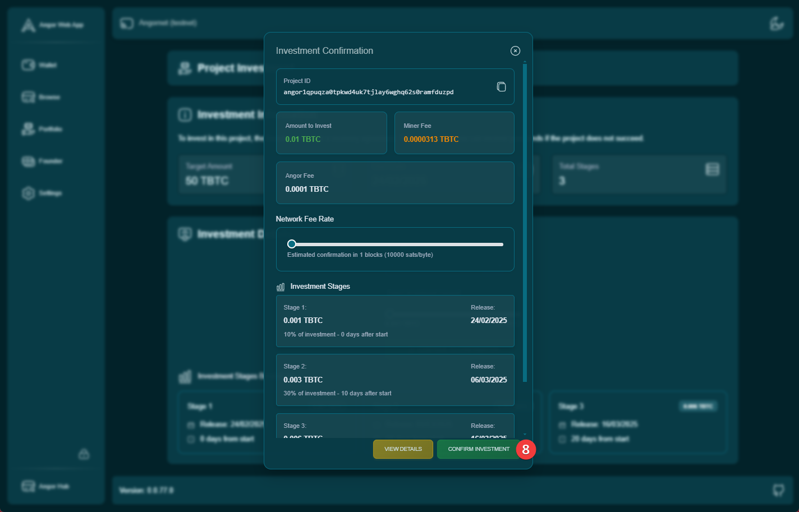

### Step 7: Await Founder Approval
Wait for the project founder to review and approve your recovery permission request.

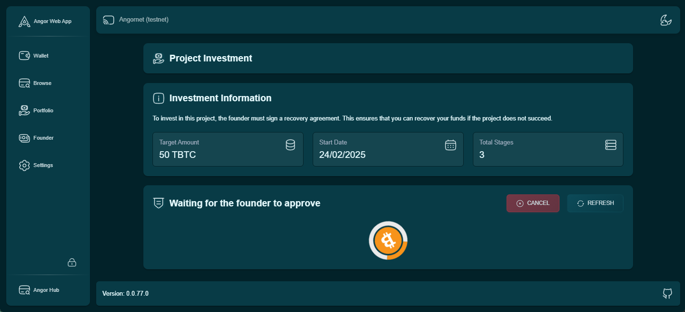

## Phase 2: Investment Execution

Once the founder approves your recovery permission request, proceed with the actual investment:

### Step 1: Review Founder's Signature
Check the received investment request and founder's signature.

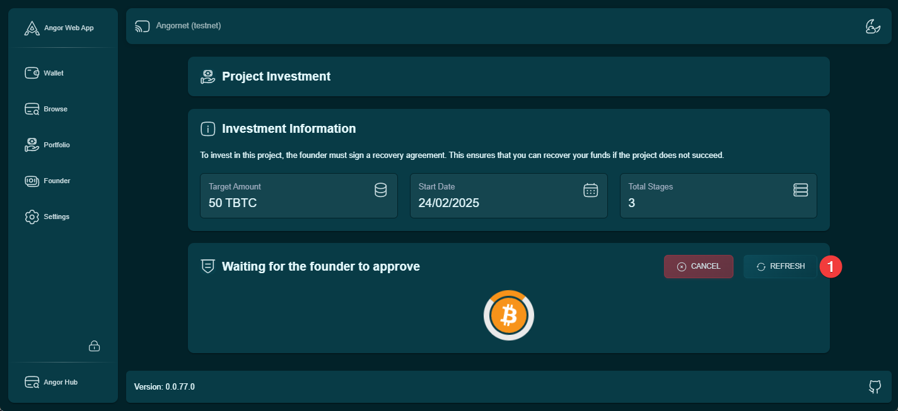

### Step 2: Wallet Authentication
Enter your wallet password to proceed with the investment.

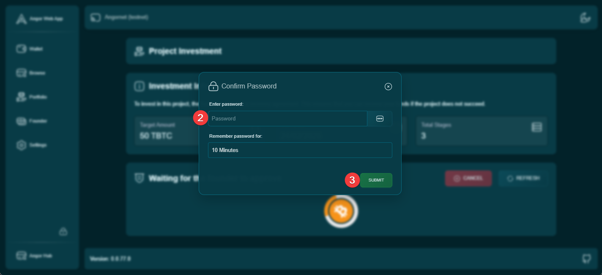

### Step 3: Execute Investment
Click the "Invest" button to send funds to the smart contract.

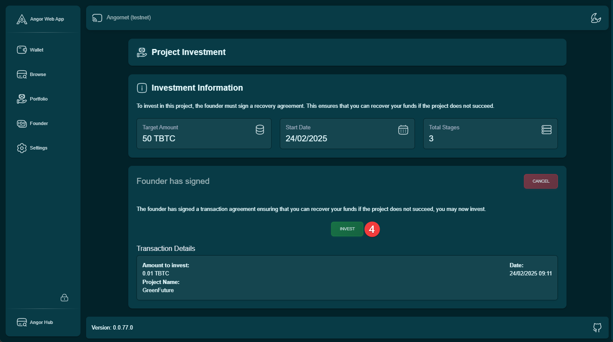

### Step 4: Investment Dashboard
Access your investor dashboard to manage and monitor your investment.

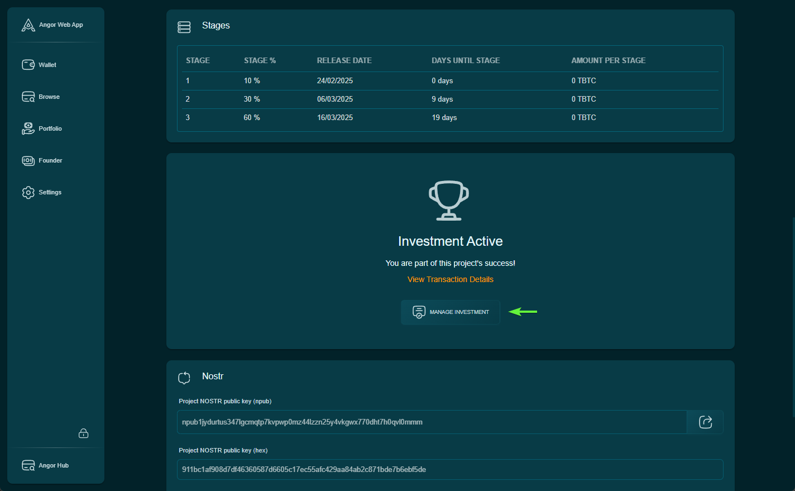

## Investment Management

After completing the investment process, you can:
- Monitor project progress
- Track investment status
- Review important dates
- Access recovery options
- Communicate with project team

## Security Considerations

### Critical Safety Measures
1. Never share private keys
2. Document all transaction IDs
3. Save recovery information securely
4. Monitor project progress regularly
5. Understand recovery procedures

### Recovery Preparation
- Store recovery keys safely
- Document timelock expiration dates
- Keep multisig information secure
- Maintain wallet backups

> **Important**: Your investment security depends on proper documentation and security practices. Always maintain copies of all transaction details and recovery information.

## Next Steps

Continue your investment journey:
- [How Angor Works](./how-angor-works)
- [Complete Recovery Options Guide](./recovery-options)
- [Investment Security Best Practices](./security-guide)
