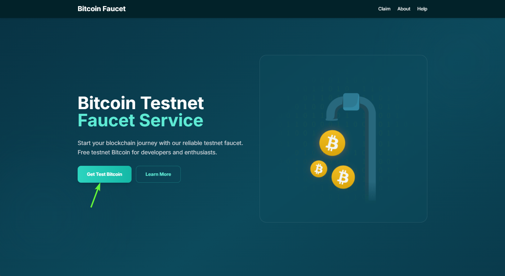
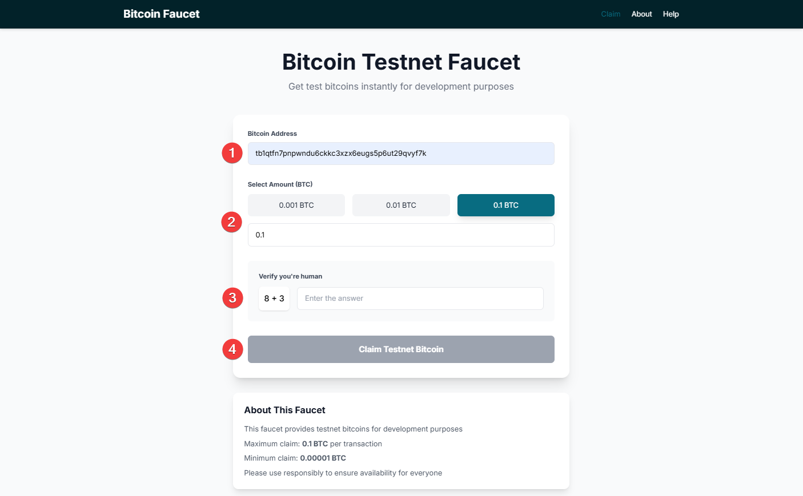

## Understanding Bitcoin Testnet Faucet

A Bitcoin Testnet Faucet is a web service that provides free test bitcoins (tBTC) for developers and users to experiment with Bitcoin functionality in a test environment. These test bitcoins have no real monetary value and are specifically designed for:
- Testing applications and smart contracts
- Learning how Bitcoin transactions work
- Developing and testing blockchain applications
- Experimenting with Angor investment features without real funds

## Why Use Angor's Bitcoin Testnet Faucet?

Angor provides a reliable testnet faucet service at [https://faucet.angor.io/](https://faucet.angor.io/) that allows you to:
- Get test bitcoins instantly
- Test Angor investment features safely
- Practice cryptocurrency transactions without risk
- Develop and test Bitcoin-based applications

## Step-by-Step Guide to Getting Test Bitcoins

### Step 1: Access the Faucet Website

1. Visit [https://faucet.angor.io/](https://faucet.angor.io/)
2. Look for the "Get Test Bitcoin" button on the main page
3. Click the button to proceed to the request form

### Step 2: Request Test Bitcoins

1. Fill in the required information:
   - Enter your Bitcoin testnet wallet address
   - Select the amount of test bitcoin you need
   - Complete the security verification
2. Click the "Claim Testnet Bitcoin" button
3. Wait for the confirmation message

### Step 3: Verify Your Transaction

After submitting your request:
1. You'll receive a transaction ID
2. The test bitcoins will appear in your wallet within a few minutes
3. You can track the transaction status using a testnet block explorer

## Important Notes

- Test bitcoins have no real value and are only for testing purposes
- There may be daily limits on how many test bitcoins you can request
- If you encounter any issues, try again after 24 hours
- Keep your testnet wallet address safe and don't share it publicly

## Next Steps

Now that you have test bitcoins, you can:
- Start testing Angor's investment features
- Practice making transactions
- Explore smart contract development
- Experiment with different Bitcoin functionalities

For more information about using test bitcoins with Angor, check our other documentation sections.
